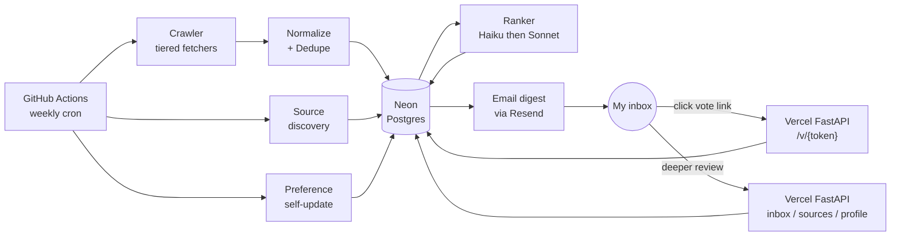

# Architecture Reference

Durable, mid-level reference for how the system is shaped. Step files cite this rather than re-explain. If a step file contradicts this doc, prefer this doc and flag the contradiction.

## High-level data flow

One weekly scheduled job (Sunday 07:30 UTC), one ambient web service for vote handling and review, one Postgres database, one LLM provider. That's the whole system.

## Components

### Crawler (Python, runs in GitHub Actions)

Reads `sources` table, picks a fetcher per row based on `fetcher_kind`, pulls postings, normalizes them, writes to `jobs` and `job_versions`. See "Fetcher tiers" below.

### Ranker (Python, runs in GitHub Actions)

For each job not yet scored:

1. **Pass 1 — Haiku 4.5 screen.** Cheap structured-output call returns `fit_score (0–100)`, `confidence (low/med/high)`, `posting_type`, `geography_match`, `dealbreaker_hits`, and a 1–2 sentence `screen_reason`. Run on every job.
2. **Pass 2 — Sonnet 4.6 deep-score.** Run only on jobs where Pass-1 `fit_score >= 60` OR `confidence == low` OR job is in a high-priority source category. Returns the full structured object: `fit_score`, `reason_to_consider`, `concerns`, `matched_signals`, `missing_info`, `recommended_action`.

Pass-1 + Pass-2 outputs are persisted in `jobs` columns plus a row in `llm_calls` for cost tracking.

### Email digest (Python, runs in GitHub Actions)

Picks top-K Pass-2 jobs (default K=8) above a threshold, plus up to 2 "borderline interesting" outliers. Renders an HTML email with one card per job: title, company, location, posting type, fit score, two sentences of reasoning, and three signed-token links (`/v/up/{tok}`, `/v/down/{tok}`, `/v/save/{tok}`). Plus a "give detailed feedback" link to the webapp.

Sent via Resend. Plain-text fallback included.

### Vote endpoint + review webapp (Python FastAPI on Vercel hobby)

Two surfaces in one tiny app:

1. **Vote endpoint:** `GET /v/{action}/{token}` validates the HMAC-signed token, records the vote, renders a confirmation page with a free-text feedback box that POSTs back to `/v/feedback/{token}`.
2. **Review webapp:** `/inbox` (today's + recent jobs), `/backlog` (unscored or unread), `/sources` (active + suggested with approve/reject buttons), `/profile` (current preference profile + any pending self-update diff to approve).

Auth: there is no login screen. Access is gated by a session cookie that's set when I click any signed-token link from email. Tokens are HMAC-signed with a server-side secret, single-use for vote actions, and time-limited (30 days) for session establishment.

### Source discovery (weekly job)

1. Build a "what does Victor like" summary: aggregate top up-voted jobs (with their company, posting type, topic tags) and top down-voted jobs from the past 30 days.
2. Ask Sonnet 4.6 for ~10–20 candidate employers I should add, each with: name, careers URL, why-this-fits rationale, expected `fetcher_kind`.
3. For each candidate, fetch the careers URL once to verify it returns 2xx and looks like a real careers page; classify the ATS type by URL pattern matching.
4. Insert into `suggested_sources` with `status = 'pending'`. Surfaced in `/sources` for me to approve / reject / snooze.

### Preference self-update (weekly job)

1. Aggregate the past week's votes and free-text feedback.
2. Ask Sonnet 4.6 to propose a structured **diff** against the current `profile.yaml`: added signals, removed signals, updated dealbreakers, updated exemplars, updated geography weights, etc. Per-change rationale required.
3. Write the proposed diff to `proposed_profile_changes` table with `status = 'pending'`. Surfaced in `/profile`.
4. On approval, the diff is applied to `profile.yaml` (committed via the running job using `peter-evans/create-pull-request` so the change is visible in git history) and the row is marked applied.

## Data model

Schema is in `migrations/`. Conceptual sketch (column lists are illustrative, not exhaustive):

### `sources`
The list of employers / careers pages to monitor.
- `id`, `name`, `careers_url`, `homepage_url`
- `category` (enum: `think_tank`, `asset_manager_policy_institute`, `geopolitical_risk`, `corporate_policy_tech`, `corporate_policy_defense`, `corporate_policy_energy`, `igo`, `government`, `predoc_program`, `phd_program`, `fellowship`)
- `fetcher_kind` (enum: `greenhouse`, `lever`, `ashby`, `workable`, `smartrecruiters`, `rippling`, `workday_json`, `camoufox`, `generic_html`, `manual`; note `rss`/`sitemap`/`playwright` remain as DB enum values but have no enabled sources and no registered fetcher)
- `fetcher_config` (jsonb — board token, base URL, selectors, etc.)
- `geography_tags` (text[]: `london`, `nyc`, `bay_area`, `boston`, `dc`, `paris`, `brussels`, `geneva`, `global`, `remote`)
- `priority` (int 1–5; affects ranker pass-2 inclusion)
- `enabled`, `approved_by_me`, `last_checked_at`, `last_success_at`, `notes`, `created_at`, `updated_at`

### `jobs`
One row per (source, canonical_id) pair. Updated on each crawl.
- `id`, `source_id`, `canonical_id` (the ATS job id or url-derived hash), `url`
- `title`, `company`, `location_raw`, `location_parsed` (jsonb), `remote_policy` (enum), `seniority` (enum), `posting_type` (enum: `role`, `fellowship`, `predoc`, `program_call`, `internal_rotation`, `unknown`)
- `description_raw` (full HTML), `description_clean` (markdown)
- `compensation` (jsonb if available)
- `first_seen_at`, `last_seen_at`, `closed_at` (set when no longer in source feed)
- `pass1_score`, `pass1_reason`, `pass1_confidence`, `pass1_dealbreaker_hits` (text[])
- `pass2_score`, `pass2_reason_to_consider`, `pass2_concerns`, `pass2_matched_signals` (text[]), `pass2_missing_info` (text[]), `pass2_recommended_action`
- `digest_sent_at` (null until included in a digest)

### `job_versions`
Append-only history. One row per crawl that observed a meaningful change in title/description/location.

### `feedback`
- `id`, `job_id`, `vote` (enum: `up`, `down`, `save`, `applied`, `hidden`), `freetext` (nullable), `created_at`, `source` (enum: `email_link`, `webapp`, `auto`)

### `suggested_sources`
- `id`, `name`, `careers_url`, `category` (suggested), `fetcher_kind` (suggested), `rationale`, `example_similar_jobs` (text[]), `status` (`pending`/`approved`/`rejected`/`snoozed`), `proposed_at`, `decided_at`

### `proposed_profile_changes`
- `id`, `diff` (jsonb), `rationale_per_change` (jsonb), `status` (`pending`/`applied`/`rejected`), `proposed_at`, `applied_at`

### `runs`
One row per scheduled job execution: kind (`weekly`/`daily`/`weekly_discovery`/`weekly_self_update`), started_at, finished_at, status, jobs_seen, jobs_new, llm_calls_count, total_cost_usd, error.

### `llm_calls`
Per-call audit: model, input_tokens, output_tokens, cost_usd, run_id, kind (`pass1`/`pass2`/`discovery`/`self_update`/`crawl_extract`), latency_ms.

## Fetcher tiers

The crawler picks a fetcher per source row by `fetcher_kind`. New fetchers are added by implementing the abstract interface and registering. Tier order reflects "use the most reliable approach available."

| Tier | Kind | Notes |
|---|---|---|
| 1 | `greenhouse` | Public Job Board API: `https://boards-api.greenhouse.io/v1/boards/{board}/jobs`. Many tech and frontier-tech employers. |
| 1 | `lever` | Public Postings API: `https://api.lever.co/v0/postings/{company}?mode=json`. |
| 1 | `ashby` | Public job board API: `https://api.ashbyhq.com/posting-api/job-board/{org}`. Some defense/tech startups. |
| 1 | `workable` | Public API where exposed. |
| 1 | `smartrecruiters` | Public API: `https://api.smartrecruiters.com/v1/companies/{company}/postings`. |
| 1 | `rippling` | Public postings endpoint for Rippling-hosted orgs (`app.rippling.com/api/o/{id}/ats/jobs`). |
| 2 | `workday_json` | Best-effort. Workday tenants expose `/wday/cxs/{tenant}/{site}/jobs` JSON endpoints; URL pattern detectable from the careers URL. Many think tanks, IGOs, and asset managers run Workday. Fragile but worth trying before browser fallback. |
| 3 | `camoufox` | **Default long-tail strategy.** Camoufox (patched Firefox) renders the careers page — its TLS fingerprint bypasses the iCIMS AWS WAF that blocks headless Chromium. Walks all `page.frames` generically so iCIMS `#icims_content_iframe` is covered with no site-specific code. Extracts roles with a forced Haiku `extract_jobs` tool call (~$0.0085/page). Logs a `crawl_extract` row to `llm_calls`. |
| 4 | `generic_html` | Retained in DB enum only; 0 enabled sources. All previously-configured `generic_html` sources migrated to `camoufox`. Per-source CSS selectors were never populated, so this tier produced 0 jobs before migration. |
| 5 | `manual` | Source flagged as un-automatable. Webapp has a "paste a job listing URL" form that triggers a one-shot LLM extract into the `jobs` table. |

The fetcher interface returns a list of `RawJob` records (typed). Normalization happens in a dedicated layer downstream, so fetchers can stay narrow.

## Ranker design

### Why two-pass

A single Sonnet pass on every crawled job would be expensive. A single Haiku pass would miss nuance on borderline cases. The two-pass split puts every job through cheap screening, and reserves the more capable model for jobs where my decision actually depends on careful reasoning.

Rough budget (78 active sources, weekly cadence, ~70 new jobs/week):
- Camoufox crawl: ~50 pages/week × ~$0.0085 = ~$1.85/month
- Pass 1: ~70 jobs × ~$0.003 avg = ~$0.85/month
- Pass 2: ~20 jobs (fit ≥ 60 from pass 1) × ~$0.015 avg = ~$1.30/month
- Source discovery: 1 Sonnet call/week ≈ $0.20/month
- **Total: ~$4.20/month** — under the $5/month target.

Note: `crawl_extract` costs (Camoufox/Haiku) are tracked in `llm_calls` rows but not currently included in `runs.total_cost_usd`. Step 11 will aggregate them.

### Structured output

Both passes use Anthropic tool-use to force JSON-shaped responses. Schema lives in `src/policy_crawler/ranker/schemas.py`. If the model returns malformed output, retry once with a stricter prompt; if it fails again, log to `llm_calls` with `error` and skip — do not block the digest.

### Exemplar augmentation

Every prompt includes the current preference profile **plus** a few-shot block of recent liked/disliked job snippets pulled from `feedback`. This short-circuits the lag between "user gives feedback" and "system reflects it" — preferences propagate the next day even before the weekly self-update runs.

## Posting-type taxonomy

The system treats these as first-class:

- **`role`** — standard employee position. Default.
- **`fellowship`** — time-limited research/leadership fellowship (Knight-Hennessy, Schwarzman, Marshall, Rhodes, etc.). Often application-driven, deadline-bound.
- **`predoc`** — predoctoral research position (RFF, Brookings RA, Federal Reserve RA, CSET research analyst, BFI). Treated separately because they're a real career path and have distinct timing/criteria.
- **`program_call`** — PhD program admissions cycle for the explicit T10 list in `02-personal-context.md`. Source URL points to the program's admissions page; the "job" is the application window.
- **`internal_rotation`** — when an MGI / equivalent rotation is announced internally and surfaced via a manually-added source. Rare.
- **`unknown`** — fallback.

The ranker is taught (via prompt) that posting type changes the reasoning: a fellowship is judged on prestige + deadline + fit; a predoc is judged on advisor / topic / PhD-pipeline value; a role on day-to-day match.

## Departures from the initial GPT proposal

Documented here so future agents don't re-introduce them by reflex:

- **No Streamlit Community Cloud.** Public-by-default; my CV and feedback data are personal. Replaced with a private Vercel-hosted FastAPI app gated by signed-token sessions.
- **No "ATS APIs are enough" assumption.** Many of my highest-value sources (think tanks, RAND, Brookings, RFF, asset managers, IGOs) don't use Greenhouse/Lever/Ashby. The fetcher tier system is built to handle Workday, iCIMS, and the browser-render long tail.
- **No autonomous source addition.** The system never adds a source on its own. Discovery is a *suggestion engine* and approval is mine.
- **No fully-autonomous profile drift.** Self-update produces a diff for me to approve. The exemplar few-shot in prompts handles same-day feedback propagation; profile-level edits are weekly + reviewed.
- **No browsing agent.** The LLM never makes HTTP requests itself. All fetching is plain Python; the LLM only sees text we give it.

## Departures from the original step specs (as-built)

Documented here so future agents understand the delta between the step docs and what's on disk:

- **Camoufox Tier-2 fetcher** was not in any original spec. It emerged when the iCIMS AWS WAF blocked Playwright; Camoufox (patched Firefox) bypasses it. It became the single long-tail strategy replacing `playwright`, `rss`, `sitemap`, and `generic_html`. Those three fetcher modules have been deleted; only the DB enum values remain.
- **Rippling Tier-1 fetcher** was added to support Eurasia Group (the only Rippling-hosted source); not in original spec.
- **Daily schedule eliminated.** The original Step 08 spec described `daily.yml` (crawl+rank+digest) and `weekly.yml` (discovery + self-update as two separate invocations). In practice `daily.yml` was deleted and everything runs as a single `--kind weekly` invocation on Sundays. The `daily`, `weekly_discovery`, and `weekly_self_update` kinds remain for ad-hoc CLI use.
- **Step 09 implemented as a single module** (`discovery/run.py`) rather than the spec's three-module design (`summarize_likes.py` + `propose_sources.py` + `validate.py`). Functionally equivalent; some minor spec features (confidence badge, 60-day auto-snooze, aggregator-URL rejection) are deferred to followups in the Step 09 doc.
